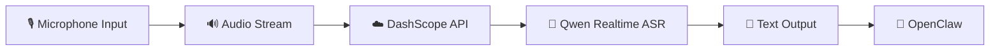
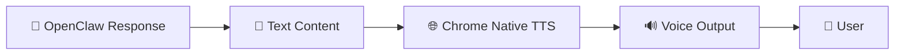
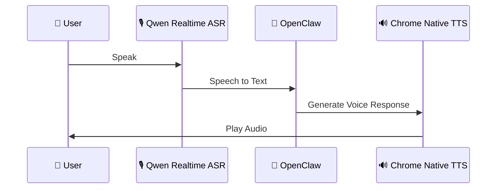
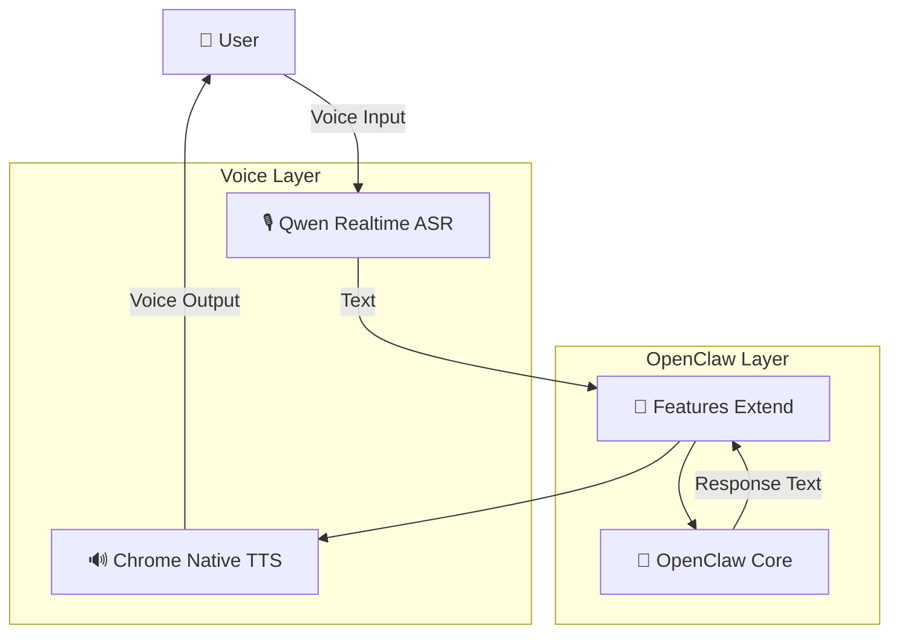

<div align="center">

# 🦞 OpenClaw Features Extend

### Extend OpenClaw with real-time voice interaction capabilities

<p>
Voice Input · Speech Recognition · Text-to-Speech
</p>

<p>
<a href="./README_CN.md">🇨🇳 中文文档</a>
</p>

<br/>

[](https://github.com/openclaw/openclaw)
[](https://dashscope.aliyun.com/)
[](https://www.google.com/chrome/)

</div>


---

## ✨ Overview

**OpenClaw Features Extend** is an extension project designed to enhance the interaction capabilities of [OpenClaw](https://github.com/openclaw/openclaw).

The project currently focuses on adding **real-time voice interaction**, enabling OpenClaw to support both voice input and voice output.

Current capabilities:

- 🎙️ **Real-time Speech Recognition**
  - Integrates Alibaba Cloud **DashScope Qwen Realtime ASR**
  - Converts microphone audio into text in real time

- 🔊 **Real-time Speech Output**
  - Uses Chrome native **Text-to-Speech (TTS)**
  - Converts OpenClaw responses into natural voice output


The goal:

> Make OpenClaw interaction more natural, moving from text-based communication toward voice-first AI experiences.


---

# 🚀 Features


## 🎙️ Real-time Speech Recognition


Powered by **DashScope Qwen Realtime ASR**, enabling real-time voice input for OpenClaw.




Users can directly speak to OpenClaw instead of manually typing instructions.

------

## 🔊 Chrome Native TTS

Supports real-time voice output through Chrome's built-in TTS capability.



This enables a complete voice interaction loop:



------

# 🧩 Architecture



------

# 📦 Supported Capabilities

| Capability             | Technology                  | Status      |
| ---------------------- | --------------------------- | ----------- |
| 🎙️ Speech Recognition   | DashScope Qwen Realtime ASR | ✅ Supported |
| 🔊 Text-to-Speech       | Chrome Native TTS           | ✅ Supported |
| 🦞 OpenClaw Integration | Extension Layer             | ✅ Supported |

------

# ⚙️ Configuration

## DashScope API Key

To enable Qwen Realtime ASR, configure your DashScope API Key.

Example:

```
export DASHSCOPE_API_KEY="your_api_key"
```

⚠️ Never commit API keys into your repository.

Use environment variables or secure secret management solutions.

------

# 🛣️ Roadmap

Future improvements:

-  🎙️ More audio input methods
-  ⚡ Better real-time streaming experience
-  🗣️ More TTS engine integrations
-  🎚️ Voice customization
-  🌍 Multi-language support
-  🧩 More OpenClaw extensions

------

# 🤝 Contributing

Contributions are welcome!

Steps:

1. Fork this repository
2. Create your feature branch
3. Implement your changes
4. Submit a Pull Request

Issues and feature suggestions are also welcome.

------

# 📄 License

Please refer to the repository license.

------


### 🦞 Extend OpenClaw. Make AI Interaction More Natural.

<a href="./README_CN.md"> 🇨🇳 中文文档 </a>
