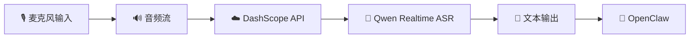
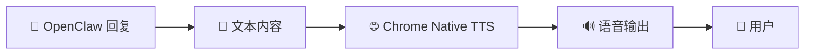
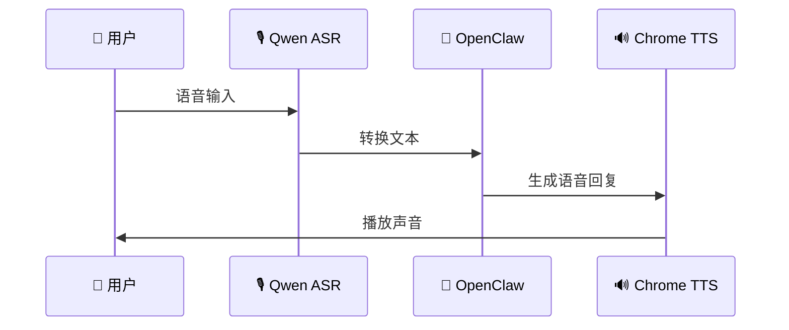
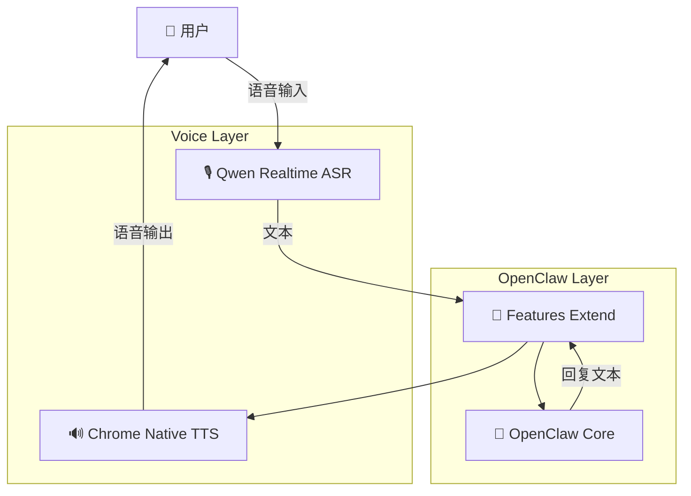

<div align="center">

# 🦞 OpenClaw 功能扩展


### 为 OpenClaw 增加实时语音交互能力


<p>
语音输入 · 实时语音识别 · 实时语音播报
</p>


<p>
<a href="./README.md">🇺🇸 English</a>
</p>


<br/>

[](https://github.com/openclaw/openclaw)
[](https://dashscope.aliyun.com/)
[](https://www.google.com/chrome/)

</div>


---

# ✨ 项目简介


**OpenClaw Features Extend** 是一个面向 [OpenClaw](https://github.com/openclaw/openclaw) 的功能扩展项目。


项目当前主要增强 OpenClaw 的：

- 🎙️ 实时语音输入能力
- 🔊 实时语音输出能力


让 OpenClaw 从传统文本交互，进一步支持更加自然的人机语音交互。


当前支持：


- 🎙️ **实时语音识别**
  - 基于阿里云 **DashScope Qwen Realtime ASR**
  - 将麦克风输入实时转换为文本


- 🔊 **实时语音播报**
  - 调用 Chrome 原生 TTS
  - 将 OpenClaw 回复转换为语音输出


项目目标：

> 让 AI Agent 的交互方式更加自然。


---

# 🚀 功能介绍


## 🎙️ 实时语音识别


通过 **DashScope Qwen Realtime ASR** 实现实时语音转文本。




用户可以直接通过语音向 OpenClaw 输入指令。

------

## 🔊 Chrome 原生 TTS

利用 Chrome 浏览器自带 Text-to-Speech 能力，实现实时语音播报。



完整语音交互流程：



------

# 🧩 系统架构



------

# 📦 当前支持能力

| 能力            | 技术方案                    | 状态     |
| --------------- | --------------------------- | -------- |
| 🎙️ 实时语音识别  | DashScope Qwen Realtime ASR | ✅ 已支持 |
| 🔊 实时语音播报  | Chrome Native TTS           | ✅ 已支持 |
| 🦞 OpenClaw 集成 | Extension Layer             | ✅ 已支持 |

------

# ⚙️ 配置

## DashScope API Key

使用 Qwen Realtime ASR 前，需要配置 DashScope API Key。

示例：

```
export DASHSCOPE_API_KEY="your_api_key"
```

⚠️ 请勿将 API Key 直接提交到 Git 仓库。

------

# 🛣️ Roadmap

未来计划：

-  🎙️ 更多音频输入方式
-  ⚡ 更低延迟实时交互
-  🗣️ 更多 TTS 引擎
-  🎚️ 声音参数配置
-  🌍 多语言支持
-  🧩 更多 OpenClaw 功能扩展

------

# 🤝 贡献

欢迎提交：

- Issue
- Pull Request
- Feature 建议

参与方式：

1. Fork 项目
2. 创建 Feature Branch
3. 提交代码
4. 发起 Pull Request

------

# 📄 License

请参考仓库 License 文件。

------

### 🦞 扩展 OpenClaw，让 AI 交互更加自然。

<a href="./README.md"> 🇺🇸 English </a>

这个版本更适合作为 GitHub 开源项目首页：

- 默认英文符合国际开源习惯
- 中文降低国内用户阅读门槛
- Mermaid 图在 GitHub 原生渲染
- 没有 ASCII 图
- 后续增加 Skill / Plugin / Tool 扩展时，结构也可以继续扩展。
